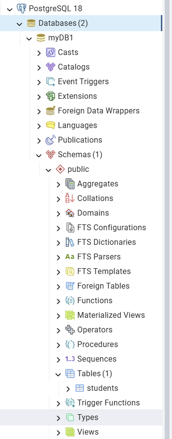

# Setup & Configuration

## Prerequisites

## Install Maven: https://maven.apache.org/download.cgi
- Make sure to add it to your environment variables.
- Check it is properly installed by going to powershell/terminal.

## Install PostgreSQL: https://www.postgresql.org/download/

- Make sure to download pgAdmin as well, easy to view tables.

In pgAdmin, right click database -> create -> database, name is myDB1, since the Java properties assuming myDB1 is the database name.

## Running the application:

Make sure your current directory is in sprint1, and then do mvn spring-boot:run.

If successful, go to your database -> schemas -> tables, and you should see student table.

## Architecture

Entity will represent a schema for a given table i.e student.

Repository will be the data retrieval/persistence layer.

In the context of MVC:

Model will be our entities.

Controllers will control input/output (it will be where the APIs are written)

View will be our frontend.
